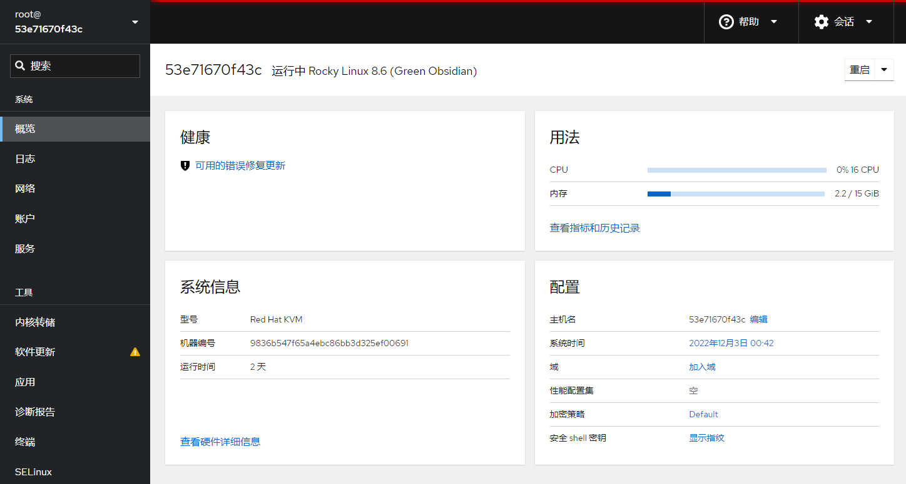
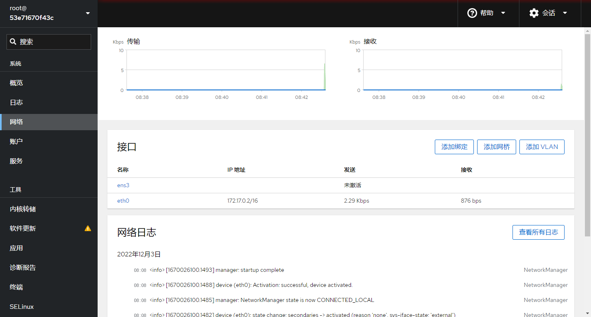
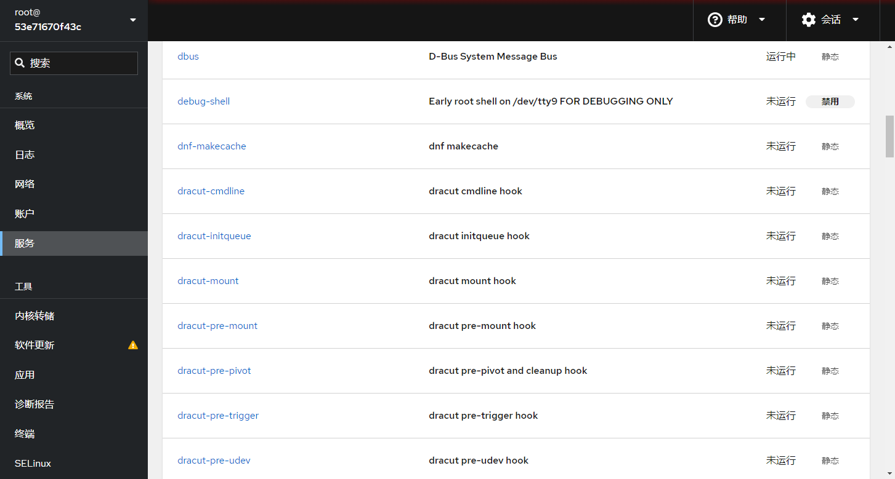
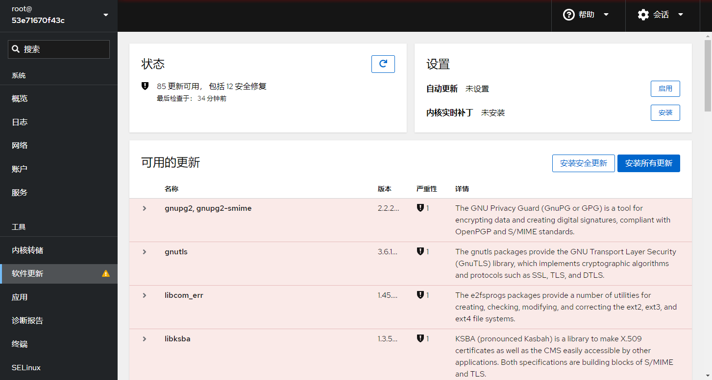
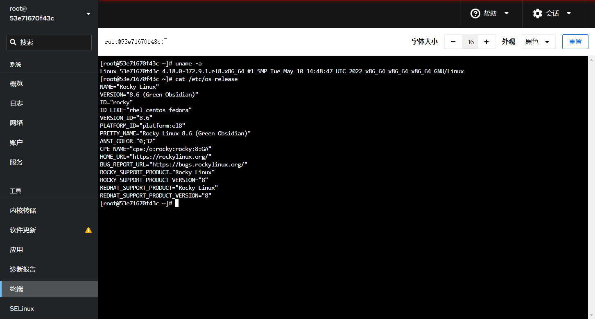

# cockpit


```
Something I hope you know before go into the coding~
First, please watch or star this repo, I'll be more happy if you follow me.
Bug report, questions and discussion are welcome, you can post an issue or pull a request.
```


**The easy-to-use, integrated, glanceable, and open web-based interface for your servers**

**Cockpit is a Red Hat sponsored free software project released under the LGPL v2.1+**

Cockpit 中文翻译 ： 驾驶舱; (飞机、船或赛车的)驾驶座;


## 相关站点


* 官方网站: <https://cockpit-project.org/>
* 官方仓库: <https://github.com/cockpit-project/cockpit>
* 官方文档: <https://cockpit-project.org/documentation.html>


## 目录

* [cockpit介绍](docs/cockpit介绍.md)
* [cockpit容器化](docs/cockpit容器化.md)
* [cockpit核心概念](docs/cockpit核心概念.md)


## 技术交流 && 意见反馈

* 打开本菜鸡Github首页，<https://github.com/yifengyou>，
* 微信/钉钉 加好友，互怼唠嗑扯犊子...有什么问题，需求， whatever~~


## 图示












---
