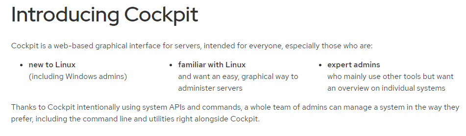
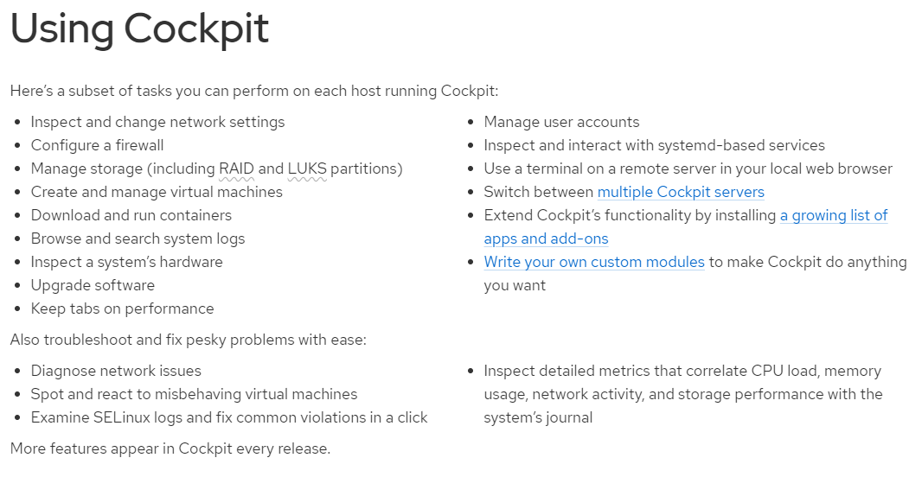
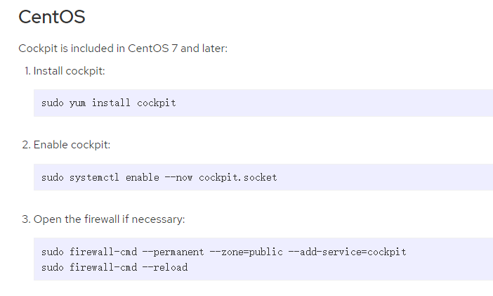
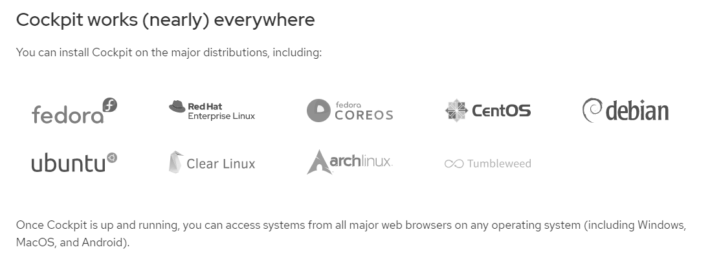
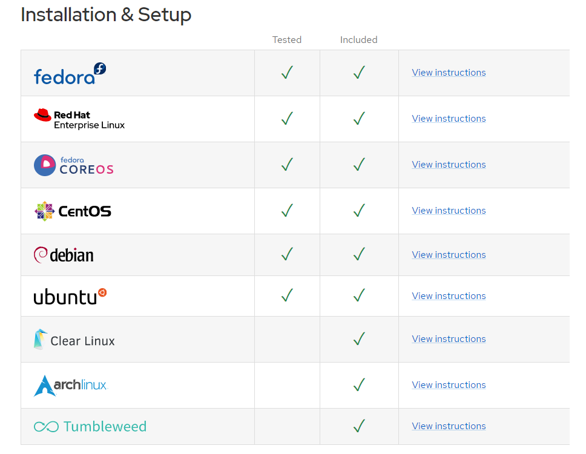

<!-- MDTOC maxdepth:6 firsth1:1 numbering:0 flatten:0 bullets:1 updateOnSave:1 -->

- [cockpit介绍](#cockpit介绍)   
   - [功能](#功能)   
   - [CentOS安装cockpit](#centos安装cockpit)   
   - [使用情况](#使用情况)   
   - [rpm包](#rpm包)   

<!-- /MDTOC -->

# cockpit介绍

* <https://cockpit-project.org/>



## 功能




## CentOS安装cockpit




1. Install cockpit:
```
sudo dnf install cockpit
```

2. Enable cockpit:
```
sudo systemctl enable --now cockpit.socket
```

3. Open the firewall if necessary:
```
sudo firewall-cmd --add-service=cockpit
sudo firewall-cmd --add-service=cockpit --permanent
```


## 使用情况






* <https://cockpit-project.org/running.html>


## rpm包

```
Last metadata expiration check: 18:10:24 ago on Fri 02 Dec 2022 02:34:37 PM CST.
cockpit.x86_64 : Web Console for Linux servers
cockpit-bridge.x86_64 : Cockpit bridge server-side component
cockpit-composer.noarch : Composer GUI for use with Cockpit
cockpit-doc.noarch : Cockpit deployment and developer guide
cockpit-file-sharing.noarch : Cockpit user interface for managing SMB and NFS file sharing.
cockpit-machines.noarch : Cockpit user interface for virtual machines
cockpit-packagekit.noarch : Cockpit user interface for packages
cockpit-pcp.x86_64 : Cockpit PCP integration
cockpit-podman.noarch : Cockpit component for Podman containers
cockpit-session-recording.noarch : Cockpit Session Recording
cockpit-storaged.noarch : Cockpit user interface for storage, using udisks
cockpit-system.noarch : Cockpit admin interface package for configuring and troubleshooting a system
cockpit-tests.x86_64 : Tests for Cockpit
cockpit-ws.x86_64 : Cockpit Web Service
subscription-manager-cockpit.noarch : Subscription Manager Cockpit UI
```


---
